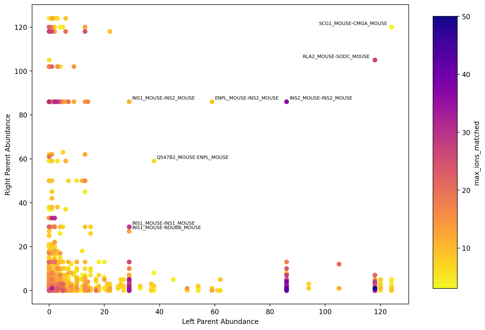

# Analysis-CometHypedsearch

## About

A program analyzes and visualizes hybrid peptides from tandem mass spectrometry data by high native parent abundance that identified from [Comet](https://github.com/UWPR/Comet) and [Hypedsearch](https://github.com/ryanlayerlab/hypedsearch).


## Getting started

### Prerequisites

* Install [Conda](https://conda.io/projects/conda/en/latest/user-guide/install/index.html)

* Output files (.txt) from **Comet** that combined in hybrid data from Hypedsearch in a folder under a working directory

* Output files (.txt) from **Hypedsearch** that provides information of hybrid peptides in a folder under the same working directory

### Installation

1. Clone the repository
```sh
   git clone https://github.com/FahsaiNak/Analysis-CometHypedsearch.git
```

2. Create the environment environment.yml
```sh
   conda env create -f environment.yml
```

3. Execute ~/src/fix_protein.py to rename the hybrid outputs (left parent-right parent|sequence) if there is not fixed. The new output table with "fix_protein" column wil be generated and stored in the assigned place. The program requires parameters as following:
    - Path of the comet+hypedsearch output folder (--comet_in)
    - Path of the hypedsearch output folder (--hypedsearch_in)
    - Path of the output file (--out)

4. Execute ~/src/count_abundance.py to compute hybrid and corresponding parent abundance. The abundance table will be stored in a result folder under the same directory. The program requires parameters as following:
    - Path of the fixed comet+hypedsearch output table folder (--comet_in)
    - Path of the hypedsearch output folder (--hypedsearch_in)
    - Path of the output file (--out)

5. Execute ~/src/plot_abundance.py to visualize hybrids and their parent abundance. The figure will be stored in a result folder under the same directory.
    - Path of the comet+hypedsearch abundance output folder (--hybrid_in)
    - Hybrid score (column) as the color bar (--score)
    - Name of the output file (--outfile)

### Usage Example
```sh
   cd example/run
   ./hybrid_analysis.sh
```
